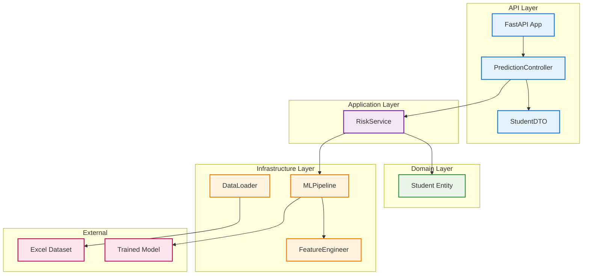
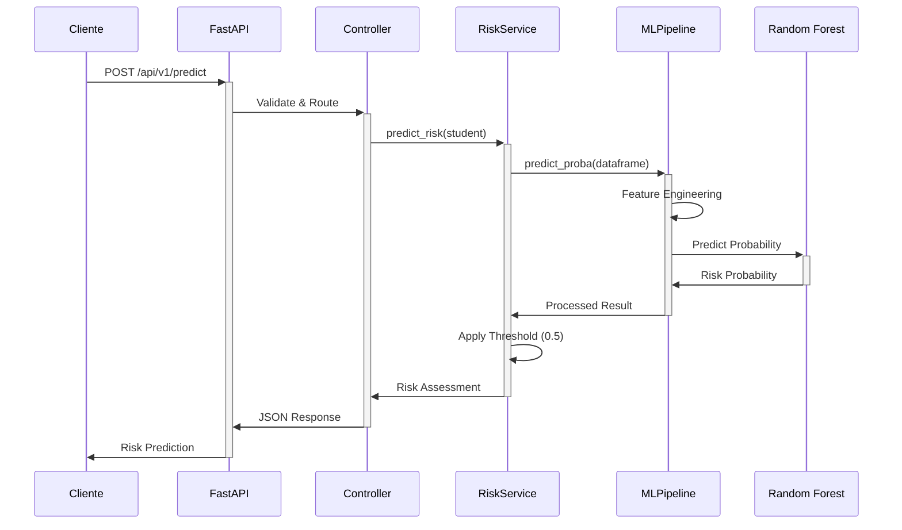

# 🎓 **Passos Mágicos - Previsão de Risco de Defasagem Escolar**

[](https://python.org)
[](https://fastapi.tiangolo.com)
[](https://scikit-learn.org)
[](https://docker.com)
[](LICENSE)

---

## 📋 **Índice**

- [Visão Geral](#visão-geral)
- [Instruções de Deploy](#instruções-de-deploy)
- [Exemplos de Chamadas à API](#exemplos-de-chamadas-à-api)
- [Pipeline de Machine Learning](#pipeline-de-machine-learning)
- [Arquitetura do Projeto](#arquitetura-do-projeto)
- [Estrutura do Projeto](#estrutura-do-projeto)
- [Licença](#licença)

---

## 🎯 **Visão Geral**

Sistema de Machine Learning desenvolvido para a **ONG Passos Mágicos** que prediz quais alunos possuem risco de defasagem escolar, permitindo intervenções preventivas e direcionadas para melhorar o desempenho acadêmico dos estudantes.

### **Objetivo Principal**

Identificar precocemente estudantes em risco de defasagem escolar através de análise preditiva, possibilitando que a ONG Passos Mágicos implemente estratégias de intervenção personalizadas e melhore os resultados educacionais.

### **Características Principais**

- 🧠 **Modelo Random Forest** com F1-Score de 0.99
- 📊 **API REST** com FastAPI para predições em tempo real
- 🏗️ **Clean Architecture** (Domain, Application, Infrastructure, API)
- 🐳 **Containerização** completa com Docker
- 📈 **Métricas de performance** detalhadas
- ⚡ **Processamento eficiente** de dados categóricos e numéricos

### **Stack Tecnológica**

| Componente | Tecnologia | Versão | Propósito |
|------------|------------|--------|-----------|
| **API Framework** | FastAPI | Latest | REST API e documentação automática |
| **ML Framework** | Scikit-learn | Latest | Random Forest Classifier |
| **Data Processing** | Pandas + NumPy | Latest | Manipulação de dados educacionais |
| **Data Source** | Excel (XLSX) | - | Dataset PEDE_PASSOS_DATASET_FIAP.xlsx |
| **Feature Engineering** | LabelEncoder | Latest | Encoding de variáveis categóricas |
| **Containerization** | Docker + Compose | Latest | Deploy e orquestração |
| **Validation** | Pydantic | Latest | Validação de dados de entrada |
| **Testing** | Pytest | Latest | Testes automatizados |

---

## 🚀 **Instruções de Deploy**

### **Pré-requisitos**

| Requisito | Versão Mínima | Observações |
|-----------|---------------|-------------|
| **Docker** | 20.10+ | Para containerização |
| **Docker Compose** | 2.0+ | Para orquestração |
| **Git** | 2.0+ | Para clone do repositório |
| **Python** | 3.11+ | Para execução local (opcional) |

### **Instalação Local**

```bash
# 1. Clone o repositório
git clone <repository-url>
cd datathon-tech5

# 2. Crie um ambiente virtual (recomendado)
python -m venv venv
source venv/bin/activate  # Linux/Mac
# ou
venv\Scripts\activate     # Windows

# 3. Instale as dependências
pip install -r requirements.txt

# 4. CRUCIAL: Execute o treinamento do modelo
python app/train.py

# 5. Inicie a API
python app/main.py
```

> **⚠️ IMPORTANTE**: O comando `python app/train.py` é **OBRIGATÓRIO** antes de iniciar a API, pois ele gera o arquivo `.joblib` necessário para as predições.

### **Deploy com Docker**

```bash
# 1. Clone o repositório
git clone <repository-url>
cd datathon-tech5

# 2. Build da imagem Docker
docker build -t passos-magicos-api .

# 3. Execução do container
docker run -p 8000:8000 passos-magicos-api

# OU usando Docker Compose (recomendado)
docker-compose up -d --build
```

### **Verificação da Instalação**

```bash
# Health check da API
curl http://localhost:8000/health

# Documentação interativa
# Acesse: http://localhost:8000/docs
```

---

## 📡 **Exemplos de Chamadas à API**

### **Endpoint de Predição**

**URL**: `POST /api/v1/predict`

### **Exemplo com cURL**

```bash
curl -X POST "http://localhost:8000/api/v1/predict" \
     -H "Content-Type: application/json" \
     -d '{
       "IDADE_22": 14,
       "CG": 7.5,
       "CF": 7.0,
       "CT": 7.2,
       "IAA": 6.8,
       "IEG": 7.1,
       "IPS": 6.9,
       "IDA": 7.0,
       "MATEM": 6.5,
       "PORTUG": 7.3,
       "INGLES": 6.8,
       "GENERO": "M",
       "TURMA": "A",
       "INSTITUICAO_DE_ENSINO": "ESCOLA MUNICIPAL"
     }'
```

### **Exemplo com Python**

```python
import requests
import json

# Dados do estudante
student_data = {
    "IDADE_22": 14,
    "CG": 7.5,
    "CF": 7.0,
    "CT": 7.2,
    "IAA": 6.8,
    "IEG": 7.1,
    "IPS": 6.9,
    "IDA": 7.0,
    "MATEM": 6.5,
    "PORTUG": 7.3,
    "INGLES": 6.8,
    "GENERO": "M",
    "TURMA": "A",
    "INSTITUICAO_DE_ENSINO": "ESCOLA MUNICIPAL"
}

# Requisição para a API
response = requests.post(
    "http://localhost:8000/api/v1/predict",
    json=student_data
)

print(json.dumps(response.json(), indent=2))
```

### **JSON de Input (Payload)**

```json
{
  "IDADE_22": 14,
  "CG": 7.5,
  "CF": 7.0,
  "CT": 7.2,
  "IAA": 6.8,
  "IEG": 7.1,
  "IPS": 6.9,
  "IDA": 7.0,
  "MATEM": 6.5,
  "PORTUG": 7.3,
  "INGLES": 6.8,
  "GENERO": "M",
  "TURMA": "A",
  "INSTITUICAO_DE_ENSINO": "ESCOLA MUNICIPAL"
}
```

**Descrição dos Campos:**
- **Features Numéricas (float)**:
  - `IDADE_22`: Idade do estudante em 2022
  - `CG`, `CF`, `CT`: Métricas de competências
  - `IAA`, `IEG`, `IPS`, `IDA`: Indicadores acadêmicos
  - `MATEM`, `PORTUG`, `INGLES`: Notas das disciplinas
- **Features Categóricas (string)**:
  - `GENERO`: Gênero do estudante
  - `TURMA`: Turma do estudante
  - `INSTITUICAO_DE_ENSINO`: Instituição de ensino

### **JSON de Output Esperado**

```json
{
  "risk_probability": 0.2340,
  "risk_label": "BAIXO RISCO",
  "message": "O estudante possui 23.4% de chance de defasagem."
}
```

**Descrição dos Campos de Resposta:**
- `risk_probability` (float): Probabilidade de risco (0.0 a 1.0)
- `risk_label` (string): "ALTO RISCO" ou "BAIXO RISCO"
- `message` (string): Mensagem explicativa com percentual

---

## 🔬 **Pipeline de Machine Learning**

### **1. Ingestão de Dados**

```python
# Leitura do dataset Excel
df = pd.read_excel("app/data/PEDE_PASSOS_DATASET_FIAP.xlsx")
```

**Fonte**: Dataset PEDE_PASSOS_DATASET_FIAP.xlsx contendo dados históricos de estudantes da ONG Passos Mágicos.

### **2. Pré-processamento**

#### **Normalização de Colunas**
- Padronização de nomes de colunas
- Tratamento de valores nulos com preenchimento por zero
- Validação de tipos de dados

#### **Criação da Variável Target**
```python
# Criação do target baseado na coluna DEFAS
df["RISCO_DEFASAGEM"] = (df["DEFAS"] < 0).astype(int)
# 1 = RISCO (DEFAS < 0)
# 0 = SEM RISCO (DEFAS >= 0)
```

### **3. Engenharia de Features**

#### **Features Numéricas (11 variáveis)**
```python
FEATURES_NUMERICAS = [
    "IDADE_22", "CG", "CF", "CT", 
    "IAA", "IEG", "IPS", "IDA",
    "MATEM", "PORTUG", "INGLES"
]
```

#### **Features Categóricas (3 variáveis)**
```python
FEATURES_CATEGORICAS = [
    "GENERO", "TURMA", "INSTITUICAO_DE_ENSINO"
]
```

#### **Label Encoding**
- Aplicação de `LabelEncoder` para variáveis categóricas
- Tratamento de valores não vistos durante treinamento (mapeamento para -1)
- Preservação do estado dos encoders para predições futuras

### **4. Modelo Random Forest**

#### **Justificativa da Escolha**
- **F1-Score**: Métrica ideal para balancear precisão e recall em problemas de classificação desbalanceada
- **Random Forest**: Robusto contra overfitting, lida bem com features categóricas e numéricas
- **Class Weight Balanced**: Compensa automaticamente o desbalanceamento de classes

#### **Configuração do Modelo**
```python
RandomForestClassifier(
    n_estimators=200,           # 200 árvores para estabilidade
    random_state=42,            # Reprodutibilidade
    class_weight="balanced"     # Balanceamento automático
)
```

#### **Pipeline Completo**
```python
pipeline = Pipeline([
    ("fe", FeatureEngineer()),      # Encoding de categóricas
    ("clf", RandomForestClassifier(...))  # Classificador
])
```

### **5. Avaliação e Métricas**

#### **Divisão dos Dados**
- **Treinamento**: 80%
- **Teste**: 20%
- **Estratificação**: Mantém proporção das classes

#### **Métricas de Performance**
- **F1-Score**: 0.99 (métrica principal)
- **Precision**: Precisão na identificação de risco
- **Recall**: Capacidade de detectar todos os casos de risco
- **Classification Report**: Relatório detalhado por classe

#### **Importância das Features**
```python
# Extração automática da importância
feature_importance = model.feature_importances_
```

### **6. Persistência do Modelo**

```python
# Salvamento do pipeline completo
joblib.dump(pipeline, "app/models/model_passos_magicos.joblib")
```

**Artefatos Salvos**:
- Pipeline completo com feature engineering
- Estado dos LabelEncoders
- Métricas de performance
- Configurações do modelo

---

## 🏗️ **Arquitetura do Projeto**

### **Clean Architecture**



### **Fluxo de Predição**



---

## 📁 **Estrutura do Projeto**

```
datathon-tech5/
├── app/
│   ├── data/
│   │   └── PEDE_PASSOS_DATASET_FIAP.xlsx    # Dataset principal
│   ├── models/
│   │   └── model_passos_magicos.joblib      # Modelo treinado
│   ├── src/
│   │   ├── api/
│   │   │   ├── controller.py                # Controladores da API
│   │   │   └── schemas.py                   # Schemas Pydantic
│   │   ├── application/
│   │   │   └── risk_service.py              # Serviços de negócio
│   │   ├── config/
│   │   │   └── settings.py                  # Configurações
│   │   ├── domain/
│   │   │   └── student.py                   # Entidades de domínio
│   │   ├── infrastructure/
│   │   │   ├── data/
│   │   │   │   └── data_loader.py           # Carregamento de dados
│   │   │   └── model/
│   │   │       ├── ml_pipeline.py           # Pipeline ML
│   │   │       └── feature_engineer.py     # Engenharia de features
│   │   └── util/
│   │       └── logger.py                    # Utilitários de log
│   ├── main.py                              # Aplicação principal
│   └── train.py                             # Script de treinamento
├── tests/                                   # Testes automatizados
├── docker-compose.yml                       # Orquestração Docker
├── Dockerfile                               # Imagem Docker
├── requirements.txt                         # Dependências Python
└── README.md                                # Documentação
```

### **Responsabilidades por Camada**

#### **API Layer**
- **controller.py**: Endpoints REST e validação de entrada
- **schemas.py**: Modelos Pydantic para validação de dados

#### **Application Layer**
- **risk_service.py**: Lógica de negócio para predição de risco

#### **Domain Layer**
- **student.py**: Entidade de domínio representando um estudante

#### **Infrastructure Layer**
- **ml_pipeline.py**: Pipeline de Machine Learning
- **feature_engineer.py**: Transformações de features
- **data_loader.py**: Carregamento de dados do Excel

---

## 📄 **Licença**

Este projeto está licenciado sob a Licença MIT - veja o arquivo [LICENSE](LICENSE) para detalhes.

---