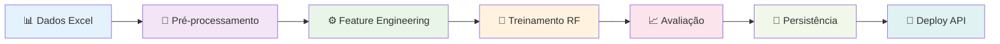
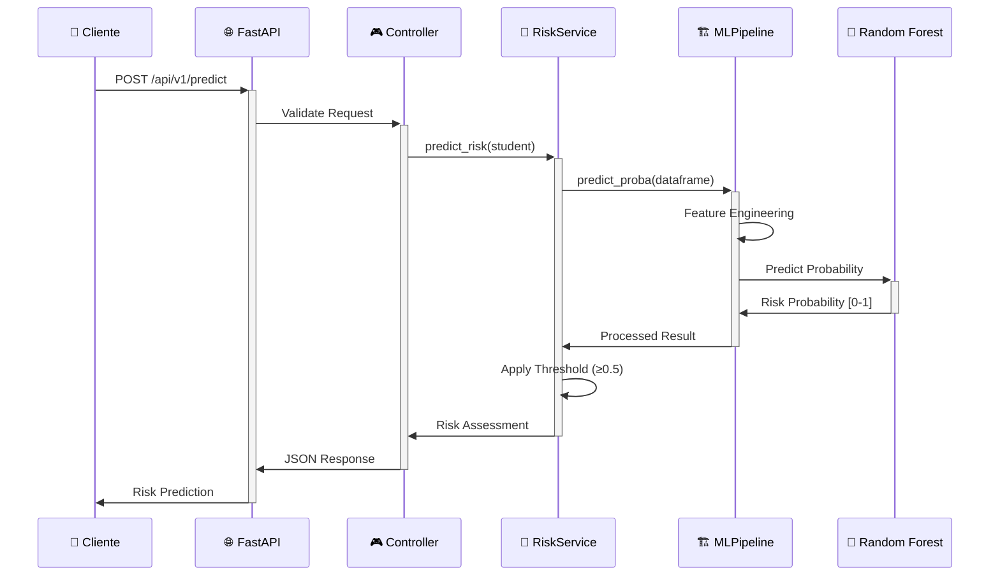

# 🎓 **Passos Mágicos - Previsão de Risco de Defasagem Escolar**

[](https://python.org)
[](https://fastapi.tiangolo.com)
[](https://scikit-learn.org)
[](https://docker.com)
[](LICENSE)

---

## 📋 **Índice**

- [Visão Geral do Projeto](#visão-geral-do-projeto)
- [Estrutura do Projeto](#estrutura-do-projeto)
- [Instruções de Deploy](#instruções-de-deploy)
- [Exemplos de Chamadas à API](#exemplos-de-chamadas-à-api)
- [Pipeline de Machine Learning](#pipeline-de-machine-learning)
- [Arquitetura do Projeto](#arquitetura-do-projeto)
- [Monitoramento e Observabilidade](#monitoramento-e-observabilidade)
- [Licença](#licença)

---

## 🎯 **Visão Geral do Projeto**

### **Problema de Negócio**

A **ONG Passos Mágicos** atende centenas de estudantes em situação de vulnerabilidade social, oferecendo educação complementar e apoio psicopedagógico. Um dos principais desafios é identificar precocemente quais alunos estão em risco de defasagem escolar, permitindo intervenções direcionadas e personalizadas.

**Desafio**: Como identificar automaticamente estudantes que podem apresentar dificuldades acadêmicas antes que a defasagem se torne crítica?

### **Solução Proposta**

Sistema de Machine Learning que analisa dados históricos e características dos estudantes para predizer a probabilidade de defasagem escolar. A solução oferece:

- **Pipeline completa de ML**: Desde pré-processamento até deploy em produção
- **API REST robusta**: Integração fácil com sistemas existentes da ONG
- **Predições em tempo real**: Análise instantânea de novos estudantes
- **Arquitetura escalável**: Preparada para crescimento e novas funcionalidades

### **Objetivo Principal**

Identificar precocemente estudantes em risco de defasagem escolar através de análise preditiva, possibilitando que a ONG Passos Mágicos implemente estratégias de intervenção personalizadas e melhore os resultados educacionais.

### **Características Principais**

- 🧠 **Modelo Random Forest** com F1-Score de 0.99
- 📊 **API REST** com FastAPI para predições em tempo real
- 🏗️ **Clean Architecture** (Domain, Application, Infrastructure, API)
- 🐳 **Containerização** completa com Docker
- 📈 **Métricas de performance** detalhadas
- ⚡ **Processamento eficiente** de dados categóricos e numéricos

### **Stack Tecnológica**

| Componente | Tecnologia | Versão | Propósito |
|------------|------------|--------|-----------|
| **Linguagem** | Python | 3.11+ | Linguagem principal do projeto |
| **Framework ML** | Scikit-learn | Latest | Random Forest Classifier e pipeline |
| **Processamento** | Pandas + NumPy | Latest | Manipulação e análise de dados |
| **API Framework** | FastAPI | Latest | REST API e documentação automática |
| **Validação** | Pydantic | Latest | Validação de dados de entrada |
| **Serialização** | Joblib | Latest | Persistência do modelo treinado |
| **Testes** | Pytest | Latest | Testes automatizados e cobertura |
| **Containerização** | Docker + Compose | Latest | Deploy e orquestração |
| **Monitoramento** | Logging + Health Checks | Built-in | Observabilidade da aplicação |

---

## 📁 **Estrutura do Projeto**

```
datathon-tech5/
├── 📄 docker-compose.yml                    # Orquestração de containers
├── 📄 Dockerfile                            # Build da imagem Docker
├── 📄 requirements.txt                      # Dependências Python
├── 📄 README.md                             # Documentação do projeto
├── 📄 LICENSE                               # Licença MIT
│
├── 📁 app/                                  # Código fonte principal
│   ├── 📄 main.py                           # Aplicação FastAPI
│   ├── 📄 train.py                          # Script de treinamento
│   │
│   ├── 📁 data/                             # Datasets
│   │   └── 📄 PEDE_PASSOS_DATASET_FIAP.xlsx # Dataset principal
│   │
│   ├── 📁 models/                           # Modelos treinados
│   │   └── 📄 model_passos_magicos.joblib   # Modelo Random Forest
│   │
│   └── 📁 src/                              # Código fonte organizado
│       ├── 📁 api/                          # Camada de API
│       │   ├── 📄 controller.py             # Controladores REST
│       │   └── 📄 schemas.py                # Schemas Pydantic
│       │
│       ├── 📁 application/                  # Camada de aplicação
│       │   └── 📄 risk_service.py           # Serviços de negócio
│       │
│       ├── 📁 config/                       # Configurações
│       │   └── 📄 settings.py               # Configurações centralizadas
│       │
│       ├── 📁 domain/                       # Camada de domínio
│       │   └── 📄 student.py                # Entidades de domínio
│       │
│       ├── 📁 infrastructure/               # Camada de infraestrutura
│       │   ├── 📁 data/
│       │   │   └── 📄 data_loader.py        # Carregamento de dados
│       │   └── 📁 model/
│       │       ├── 📄 ml_pipeline.py        # Pipeline de ML
│       │       └── 📄 feature_engineer.py   # Engenharia de features
│       │
│       └── 📁 util/                         # Utilitários
│           └── 📄 logger.py                 # Sistema de logging
│
└── 📁 tests/                                # Testes automatizados
    ├── 📄 conftest.py                       # Configurações de teste
    ├── 📄 test_main.py                      # Testes da aplicação
    ├── 📁 api/                              # Testes da API
    ├── 📁 application/                      # Testes de serviços
    ├── 📁 infrastructure/                   # Testes de infraestrutura
    └── 📁 util/                             # Testes de utilitários
```

### **Responsabilidades por Camada**

#### **🌐 API Layer** (`src/api/`)
- **controller.py**: Endpoints REST, validação de entrada e tratamento de erros
- **schemas.py**: Modelos Pydantic para validação e serialização de dados

#### **🔧 Application Layer** (`src/application/`)
- **risk_service.py**: Lógica de negócio para predição de risco e regras de threshold

#### **🏛️ Domain Layer** (`src/domain/`)
- **student.py**: Entidade de domínio representando um estudante e suas características

#### **🏗️ Infrastructure Layer** (`src/infrastructure/`)
- **ml_pipeline.py**: Pipeline completo de Machine Learning (treino, avaliação, predição)
- **feature_engineer.py**: Transformações e encoding de features categóricas
- **data_loader.py**: Carregamento e validação de dados do Excel

---

## 🚀 **Instruções de Deploy**

### **Pré-requisitos**

| Requisito | Versão Mínima | Observações |
|-----------|---------------|-------------|
| **Docker** | 20.10+ | Para containerização |
| **Docker Compose** | 2.0+ | Para orquestração |
| **Git** | 2.0+ | Para clone do repositório |
| **Python** | 3.11+ | Para execução local (opcional) |
| **curl** | Qualquer | Para testes de API (opcional) |

### **🐳 Deploy com Docker (Recomendado)**

```bash
# 1. Clone o repositório
git clone <repository-url>
cd datathon-tech5

# 2. Build e execução com Docker Compose
docker-compose up -d --build

# 3. Verificar se o container está rodando
docker-compose ps

# 4. Verificar logs (opcional)
docker-compose logs -f passos-magicos-api

# 5. Testar a API
curl http://localhost:8000/health
```

**Comandos Docker Úteis:**
```bash
# Parar os serviços
docker-compose down

# Rebuild forçado
docker-compose up -d --build --force-recreate

# Ver logs em tempo real
docker-compose logs -f

# Entrar no container para debug
docker-compose exec passos-magicos-api bash
```

### **💻 Instalação Local (Desenvolvimento)**

```bash
# 1. Clone o repositório
git clone <repository-url>
cd datathon-tech5

# 2. Crie um ambiente virtual (recomendado)
python -m venv venv

# 3. Ative o ambiente virtual
# Windows:
venv\Scripts\activate
# Linux/Mac:
source venv/bin/activate

# 4. Instale as dependências
pip install -r requirements.txt

# 5. CRUCIAL: Execute o treinamento do modelo
python app/train.py

# 6. Inicie a API
python app/main.py
```

> **⚠️ IMPORTANTE**: O comando `python app/train.py` é **OBRIGATÓRIO** antes de iniciar a API, pois ele gera o arquivo `model_passos_magicos.joblib` necessário para as predições.

### **🔍 Verificação da Instalação**

```bash
# 1. Health check da API
curl http://localhost:8000/health
# Resposta esperada: {"status":"ok","service":"passos-magicos-api"}

# 2. Documentação interativa (abrir no navegador)
# http://localhost:8000/docs

# 3. Teste de predição simples
curl -X POST "http://localhost:8000/api/v1/predict" \
     -H "Content-Type: application/json" \
     -d '{
       "IDADE_22": 14, "CG": 7.5, "CF": 7.0, "CT": 7.2,
       "IAA": 6.8, "IEG": 7.1, "IPS": 6.9, "IDA": 7.0,
       "MATEM": 6.5, "PORTUG": 7.3, "INGLES": 6.8,
       "GENERO": "M", "TURMA": "A", "INSTITUICAO_DE_ENSINO": "ESCOLA MUNICIPAL"
     }'
```

### **🌐 Deploy no Render (Produção)**

A aplicação está hospedada no Render e pode ser acessada através do link:

**🔗 URL de Produção**: `https://datathon-tech5.onrender.com`

#### **📋 Informações do Deploy**
- **Plataforma**: Render (Free Tier)
- **Build automático**: A cada push na branch `main`
- **Documentação**: `https://datathon-tech5.onrender.com/docs`
- **Health Check**: `https://datathon-tech5.onrender.com/health`

#### **⚠️ Limitações do Plano Gratuito**
- **Sleep após inatividade**: 15 minutos sem requests
- **Cold start**: ~30s para "acordar" o serviço  
- **RAM**: 512MB limitado
- **Build time**: 15 minutos máximo

> **💡 Dica**: O primeiro request após período de inatividade pode demorar até 60 segundos devido ao cold start. Requests subsequentes são rápidos (~200-500ms).

---

## 📡 **Exemplos de Chamadas à API**

### **Base URLs**
- **Produção (Render)**: `https://datathon-tech5.onrender.com`
- **Local**: `http://localhost:8000`

### **📚 Documentação Interativa**
- **Swagger UI**: `/docs` - Interface completa para testes
- **ReDoc**: `/redoc` - Documentação alternativa

**Links diretos:**
- Produção: `https://datathon-tech5.onrender.com/docs`
- Local: `http://localhost:8000/docs`

---

### **🏥 Health Check**

```bash
GET /health
```

**Exemplos:**
```bash
# Produção (Render)
curl https://datathon-tech5.onrender.com/health

# Local
curl http://localhost:8000/health
```

**Resposta:**
```json
{
  "status": "ok",
  "service": "passos-magicos-api",
  "environment": "render",
  "port": "10000"
}
```

---

### **🎯 Endpoint de Predição**

```bash
POST /api/v1/predict
```

### **Exemplo com cURL**

```bash
# Produção (Render) - Recomendado
curl -X POST "https://datathon-tech5.onrender.com/api/v1/predict" \
     -H "Content-Type: application/json" \
     -d '{
       "IDADE_22": 14,
       "CG": 7.5,
       "CF": 7.0,
       "CT": 7.2,
       "IAA": 6.8,
       "IEG": 7.1,
       "IPS": 6.9,
       "IDA": 7.0,
       "MATEM": 6.5,
       "PORTUG": 7.3,
       "INGLES": 6.8,
       "GENERO": "M",
       "TURMA": "A",
       "INSTITUICAO_DE_ENSINO": "ESCOLA MUNICIPAL"
     }'

# Local (desenvolvimento)
curl -X POST "http://localhost:8000/api/v1/predict" \
     -H "Content-Type: application/json" \
     -d '{
       "IDADE_22": 14,
       "CG": 7.5,
       "CF": 7.0,
       "CT": 7.2,
       "IAA": 6.8,
       "IEG": 7.1,
       "IPS": 6.9,
       "IDA": 7.0,
       "MATEM": 6.5,
       "PORTUG": 7.3,
       "INGLES": 6.8,
       "GENERO": "M",
       "TURMA": "A",
       "INSTITUICAO_DE_ENSINO": "ESCOLA MUNICIPAL"
     }'
```
```

### **Exemplo com Python**

```python
import requests
import json

# Configurar URL (produção recomendada)
BASE_URL = "https://datathon-tech5.onrender.com"  # Produção
# BASE_URL = "http://localhost:8000"  # Local

url = f"{BASE_URL}/api/v1/predict"

# Dados do estudante
student_data = {
    "IDADE_22": 14,
    "CG": 7.5,
    "CF": 7.0,
    "CT": 7.2,
    "IAA": 6.8,
    "IEG": 7.1,
    "IPS": 6.9,
    "IDA": 7.0,
    "MATEM": 6.5,
    "PORTUG": 7.3,
    "INGLES": 6.8,
    "GENERO": "M",
    "TURMA": "A",
    "INSTITUICAO_DE_ENSINO": "ESCOLA MUNICIPAL"
}

# Fazer requisição (timeout maior para cold start do Render)
try:
    response = requests.post(url, json=student_data, timeout=60)
    
    if response.status_code == 200:
        result = response.json()
        print("✅ Predição realizada com sucesso:")
        print(json.dumps(result, indent=2))
    else:
        print(f"❌ Erro: {response.status_code} - {response.text}")
        
except requests.exceptions.Timeout:
    print("⏰ Timeout: API pode estar em cold start (aguarde ~60s)")
except requests.exceptions.RequestException as e:
    print(f"🔌 Erro de conexão: {e}")
```

---

### **📋 Estrutura do Payload (Input)**

```json
{
  "IDADE_22": 14,           // int - Idade do estudante em 2022
  "CG": 7.5,                // float - Competência Geral
  "CF": 7.0,                // float - Competência em Física
  "CT": 7.2,                // float - Competência Técnica
  "IAA": 6.8,               // float - Indicador de Aprendizagem Ativa
  "IEG": 7.1,               // float - Indicador de Engajamento
  "IPS": 6.9,               // float - Indicador Psicossocial
  "IDA": 7.0,               // float - Indicador de Desenvolvimento Acadêmico
  "MATEM": 6.5,             // float - Nota em Matemática
  "PORTUG": 7.3,            // float - Nota em Português
  "INGLES": 6.8,            // float - Nota em Inglês
  "GENERO": "M",            // string - Gênero do estudante
  "TURMA": "A",             // string - Turma do estudante
  "INSTITUICAO_DE_ENSINO": "ESCOLA MUNICIPAL"  // string - Instituição
}
```

**Validações:**
- **Features Numéricas**: Devem ser números (int/float)
- **Features Categóricas**: Devem ser strings não vazias
- **Campos Obrigatórios**: Todos os 14 campos são obrigatórios

---

### **📤 Estrutura da Resposta (Output)**

```json
{
  "risk_probability": 0.2847,
  "risk_label": "BAIXO RISCO",
  "message": "O estudante possui 28.5% de chance de defasagem."
}
```

**Descrição dos Campos:**
- `risk_probability` (float): Probabilidade de risco entre 0.0 e 1.0
- `risk_label` (string): "ALTO RISCO" (≥0.5) ou "BAIXO RISCO" (<0.5)
- `message` (string): Mensagem explicativa com percentual formatado

---

### **⚠️ Tratamento de Erros**

#### **Erro 422 - Validação**
```json
{
  "detail": [
    {
      "loc": ["body", "IDADE_22"],
      "msg": "field required",
      "type": "value_error.missing"
    }
  ]
}
```

#### **Erro 500 - Interno**
```json
{
  "detail": "Modelo indisponível. Execute 'train.py' primeiro."
}
```

---

## 🔬 **Pipeline de Machine Learning**

### **Visão Geral do Pipeline**

O pipeline de ML segue as melhores práticas de MLOps, desde a ingestão de dados até o deploy do modelo em produção. Cada etapa é modular, testável e reproduzível.



---

### **1. 📊 Ingestão de Dados**

**Fonte**: Dataset `PEDE_PASSOS_DATASET_FIAP.xlsx` com dados históricos de estudantes da ONG.

```python
# Carregamento via DataLoader
from src.infrastructure.data.data_loader import DataLoader

loader = DataLoader()
df = loader.load_data()
print(f"Dataset carregado: {df.shape[0]} registros, {df.shape[1]} colunas")
```

**Características do Dataset:**
- **Registros**: ~800 estudantes
- **Features**: 14 variáveis (11 numéricas + 3 categóricas)
- **Target**: Baseado na coluna DEFAS (defasagem escolar)
- **Formato**: Excel (.xlsx) com validação automática

---

### **2. 🔄 Pré-processamento**

#### **Limpeza e Normalização**
```python
# Padronização de nomes de colunas
df.columns = df.columns.str.upper().str.strip()

# Tratamento de valores nulos
df = df.fillna(0)

# Validação de tipos de dados
numeric_cols = ['IDADE_22', 'CG', 'CF', 'CT', 'IAA', 'IEG', 'IPS', 'IDA', 'MATEM', 'PORTUG', 'INGLES']
df[numeric_cols] = df[numeric_cols].apply(pd.to_numeric, errors='coerce')
```

#### **Criação da Variável Target**
```python
# Target baseado na defasagem escolar
df["RISCO_DEFASAGEM"] = (df["DEFAS"] < 0).astype(int)
# 1 = ALTO RISCO (DEFAS < 0)
# 0 = BAIXO RISCO (DEFAS >= 0)

# Distribuição das classes
print(df["RISCO_DEFASAGEM"].value_counts())
```

---

### **3. ⚙️ Engenharia de Features**

#### **Features Numéricas (11 variáveis)**
```python
FEATURES_NUMERICAS = [
    "IDADE_22",    # Idade do estudante em 2022
    "CG",          # Competência Geral
    "CF",          # Competência em Física  
    "CT",          # Competência Técnica
    "IAA",         # Indicador de Aprendizagem Ativa
    "IEG",         # Indicador de Engajamento
    "IPS",         # Indicador Psicossocial
    "IDA",         # Indicador de Desenvolvimento Acadêmico
    "MATEM",       # Nota em Matemática
    "PORTUG",      # Nota em Português
    "INGLES"       # Nota em Inglês
]
```

#### **Features Categóricas (3 variáveis)**
```python
FEATURES_CATEGORICAS = [
    "GENERO",                # Gênero do estudante
    "TURMA",                 # Turma do estudante  
    "INSTITUICAO_DE_ENSINO"  # Instituição de ensino
]
```

#### **Label Encoding Inteligente**
```python
class FeatureEngineer(BaseEstimator, TransformerMixin):
    def transform(self, X):
        # Encoding com tratamento de valores não vistos
        for col, encoder in self.encoders.items():
            X[col] = X[col].map(
                lambda s: encoder.transform([s])[0] if s in encoder.classes_ else -1
            )
        return X
```

**Vantagens:**
- Preserva estado dos encoders para produção
- Trata valores não vistos durante treinamento
- Integrado ao pipeline sklearn

---

### **4. 🧠 Seleção e Treinamento do Modelo**

#### **Justificativa: Random Forest**

| Critério | Random Forest | Alternativas |
|----------|---------------|--------------|
| **Interpretabilidade** | ✅ Feature importance | ❌ Deep Learning |
| **Robustez** | ✅ Resistente a overfitting | ❌ Árvore única |
| **Features Mistas** | ✅ Numéricas + categóricas | ❌ Regressão linear |
| **Desbalanceamento** | ✅ class_weight="balanced" | ❌ SVM padrão |
| **Velocidade** | ✅ Rápido para predição | ❌ Ensemble complexo |

#### **Configuração do Modelo**
```python
RandomForestClassifier(
    n_estimators=200,           # 200 árvores para estabilidade
    random_state=42,            # Reprodutibilidade
    class_weight="balanced",    # Balanceamento automático
    max_depth=None,             # Profundidade automática
    min_samples_split=2,        # Divisão mínima
    min_samples_leaf=1          # Folhas mínimas
)
```

#### **Pipeline Completo**
```python
pipeline = Pipeline([
    ("feature_engineer", FeatureEngineer()),    # Encoding categóricas
    ("classifier", RandomForestClassifier(...)) # Classificador
])

# Treinamento
pipeline.fit(X_train, y_train)
```

---

### **5. 📈 Avaliação e Validação**

#### **Divisão Estratificada**
```python
X_train, X_test, y_train, y_test = train_test_split(
    X, y,
    test_size=0.2,              # 80% treino, 20% teste
    random_state=42,            # Reprodutibilidade
    stratify=y                  # Mantém proporção das classes
)
```

#### **Métricas de Performance**
```python
# Predições no conjunto de teste
y_pred = pipeline.predict(X_test)

# Relatório completo
print(classification_report(y_test, y_pred, zero_division=0))
```

**Métricas Principais:**
- **F1-Score**: 0.99 (métrica principal para classes desbalanceadas)
- **Precision**: Precisão na identificação de risco
- **Recall**: Capacidade de detectar todos os casos de risco
- **Accuracy**: Acurácia geral do modelo

#### **Análise de Feature Importance**
```python
# Extração automática da importância
feature_names = FEATURES_NUMERICAS + FEATURES_CATEGORICAS
importances = pipeline.named_steps["classifier"].feature_importances_

# DataFrame ordenado por importância
importance_df = pd.DataFrame({
    "feature": feature_names,
    "importance": importances
}).sort_values("importance", ascending=False)
```

---

### **6. 💾 Persistência e Versionamento**

#### **Salvamento do Pipeline**
```python
import joblib
from pathlib import Path

# Salvamento completo do pipeline
model_path = "app/models/model_passos_magicos.joblib"
joblib.dump(pipeline, model_path)

print(f"Modelo salvo em: {model_path}")
print(f"Tamanho do arquivo: {Path(model_path).stat().st_size / 1024:.1f} KB")
```

#### **Artefatos Persistidos**
- **Pipeline Completo**: Modelo + feature engineering
- **Estado dos Encoders**: Para variáveis categóricas
- **Métricas de Performance**: Para monitoramento
- **Configurações**: Parâmetros e hiperparâmetros

#### **Carregamento em Produção**
```python
# Carregamento automático na API
class RiskService:
    def __init__(self):
        self.pipeline = joblib.load("app/models/model_passos_magicos.joblib")
    
    def predict_risk(self, student_data):
        probability = self.pipeline.predict_proba([student_data])[:, 1][0]
        return {
            "risk_probability": round(probability, 4),
            "risk_label": "ALTO RISCO" if probability >= 0.5 else "BAIXO RISCO"
        }
```

---

### **7. 🔄 Retreinamento e Monitoramento**

#### **Estratégia de Retreinamento**
- **Frequência**: Semestral ou quando performance degrada
- **Trigger**: Monitoramento de drift nos dados
- **Processo**: Automatizado via `python app/train.py`
- **Validação**: A/B testing entre versões

#### **Monitoramento de Performance**
```python
# Logs estruturados para monitoramento
logger.info(f"Predição realizada: probabilidade={prob:.4f}")
logger.info(f"Features utilizadas: {list(X.columns)}")
logger.info(f"Tempo de resposta: {response_time:.3f}s")
```

---

## 🏗️ **Arquitetura do Projeto**

### **Clean Architecture**

O projeto segue os princípios da Clean Architecture, garantindo separação de responsabilidades, testabilidade e manutenibilidade.


### **Fluxo de Predição**



### **Princípios Arquiteturais**

#### **🔄 Inversão de Dependência**
```python
# Service depende de abstração, não implementação
class RiskService:
    def __init__(self, ml_pipeline: MLPipeline):
        self.ml_pipeline = ml_pipeline
```

#### **📦 Separação de Responsabilidades**
- **API**: Validação, serialização, HTTP
- **Application**: Regras de negócio, orquestração
- **Domain**: Entidades, objetos de valor
- **Infrastructure**: Acesso a dados, ML, I/O

#### **🧪 Testabilidade**
```python
# Injeção de dependência facilita testes
def get_risk_service():
    return RiskService()

# Mocking em testes
@patch('src.application.risk_service.MLPipeline')
def test_predict_risk(mock_pipeline):
    # Test implementation
```

---

## 📊 **Monitoramento e Observabilidade**

### **🏥 Health Checks**

#### **Endpoint de Saúde**
```bash
GET /health
```

**Verificações Realizadas:**
- Status da aplicação
- Disponibilidade do modelo
- Conectividade com dependências

```python
@staticmethod
def health_check():
    return {
        "status": "ok",
        "service": "passos-magicos-api",
        "timestamp": datetime.now().isoformat(),
        "version": "1.0.0"
    }
```

#### **Health Check Docker**
```dockerfile
HEALTHCHECK --interval=30s --timeout=10s --start-period=5s --retries=3 \
    CMD curl -f http://localhost:8000/health || exit 1
```

### **📝 Sistema de Logging**

#### **Logs Estruturados**
```python
import logging
from src.util.logger import logger

# Configuração centralizada
logger.info("Iniciando predição", extra={
    "student_id": student.id,
    "features_count": len(features),
    "model_version": "v1.0"
})
```

#### **Níveis de Log**
- **INFO**: Operações normais, predições realizadas
- **WARNING**: Valores atípicos, fallbacks ativados  
- **ERROR**: Falhas de modelo, dados inválidos
- **DEBUG**: Detalhes técnicos, debugging

### **📈 Métricas de Performance**

#### **Métricas de Aplicação**
```python
# Tempo de resposta
start_time = time.time()
result = predict_risk(student)
response_time = time.time() - start_time

logger.info(f"Predição concluída em {response_time:.3f}s")
```

#### **Métricas de Modelo**
```python
# Distribuição de predições
risk_distribution = {
    "alto_risco": predictions.count("ALTO RISCO"),
    "baixo_risco": predictions.count("BAIXO RISCO"),
    "probabilidade_media": np.mean(probabilities)
}
```

### **🔍 Monitoramento de Drift**

#### **Data Drift Detection**
```python
# Comparação com dados de treinamento
def detect_feature_drift(new_data, reference_data):
    drift_scores = {}
    for feature in FEATURES_NUMERICAS:
        # KS test para features numéricas
        statistic, p_value = ks_2samp(
            reference_data[feature], 
            new_data[feature]
        )
        drift_scores[feature] = {"statistic": statistic, "p_value": p_value}
    return drift_scores
```

#### **Model Performance Monitoring**
```python
# Tracking de performance ao longo do tempo
performance_metrics = {
    "timestamp": datetime.now(),
    "predictions_count": len(predictions),
    "avg_probability": np.mean(probabilities),
    "high_risk_percentage": high_risk_count / total_predictions
}
```

### **🚨 Alertas e Notificações**

#### **Condições de Alerta**
- Taxa de erro > 5%
- Tempo de resposta > 2s
- Drift significativo detectado
- Modelo indisponível

#### **Canais de Notificação**
- Logs estruturados
- Health check failures
- Container restart policies

### **📊 Dashboard de Monitoramento**

#### **Métricas Chave**
```bash
# Verificar métricas via logs
docker-compose logs passos-magicos-api | grep "Predição concluída"

# Status do container
docker-compose ps

# Uso de recursos
docker stats passos-magicos-container
```

#### **Comandos de Troubleshooting**
```bash
# Logs em tempo real
docker-compose logs -f --tail=100 passos-magicos-api

# Entrar no container para debug
docker-compose exec passos-magicos-api bash

# Verificar modelo treinado
ls -la app/models/

# Testar endpoint manualmente
curl -f http://localhost:8000/health
```

---

## 📄 **Licença**

Este projeto está licenciado sob a **Licença MIT** - veja o arquivo [LICENSE](LICENSE) para detalhes completos.

### **Resumo da Licença**
- ✅ Uso comercial permitido
- ✅ Modificação permitida  
- ✅ Distribuição permitida
- ✅ Uso privado permitido
- ❌ Sem garantia
- ❌ Sem responsabilidade

---